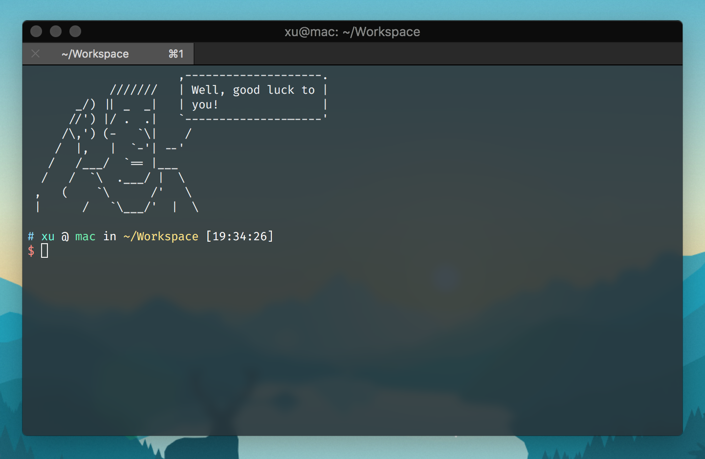
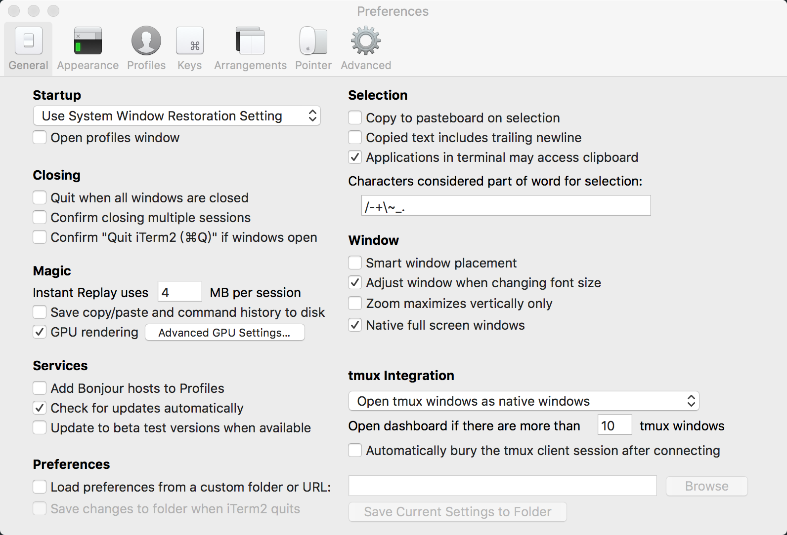
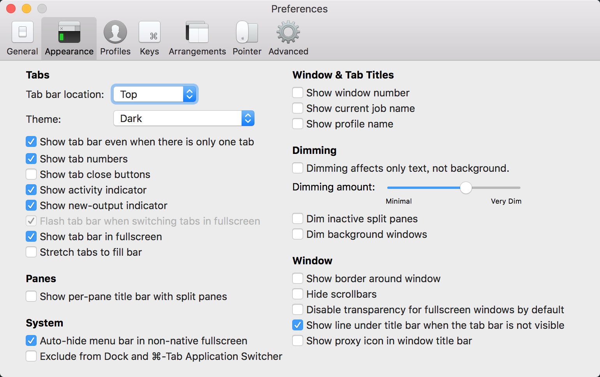

# xu’s dot-files

> 本人 MacOS 装机配置



### 写在前面

**Warning:** 使用有风险，请自行取舍

### First

```
$ git clone https://github.com/ouxu/dot-files.git
$ chmod +x *.sh
```

### 日常工具

#### ssh

新的电脑, 新的 ssh key

```
$ ssh-keygen -t rsa -C "youremail@example.com"
```

#### brew

[homebrew](https://brew.sh/)

安装软件, 建议最后安装, 安装列表见文件 `brew-casks`

```
$ ./brew.sh
```

#### 字体

[homebrew-cask-fonts](https://github.com/Homebrew/homebrew-cask-fonts)

```
$ brew tap homebrew/cask-fonts
```

字体推荐 `Fira Code`

```
$ brew cask install font-fira-code
$ brew cask install font-meslo-for-powerline
$ brew cask install font-sarasa-gothic          # 更纱黑体
```

附带一款字体: [oml](https://oml-font.now.sh/)

#### zsh

[oh-my-zsh](https://ohmyz.sh/)

`zsh` 配置
```
$ cp .zshrc ~/.zshrc
```

alias 列表:
 - pwc:  pwd + copy
 - mkdir: mkdir dir && cd dir
 - cdtmp: cd /private/tmp/xu-random

安装 oh-my-zsh 高亮插件
```
$ git clone https://github.com/zsh-users/zsh-syntax-highlighting.git ${ZSH_CUSTOM:-~/.oh-my-zsh/custom}/plugins/zsh-syntax-highlighting
```

`motd` 输出字符

`hushlogin` 禁用 `motd`, 并在 `.zshrc` 中 `cat /etc/motd`

```
$ mkdir ~/.hushlogin
$ sudo cp ./motd /etc/motd
```

#### vim

我用 [SpaceVim](https://spacevim.org/cn/quick-start-guide/#linux-%E6%88%96-macos)

建议重装下 vim, 覆盖系统 vim

```
$ brew reinstall vim --with-lua --with-python3 --with-override-system-vi
```

`SpaceVim` 配置

```
$ cp .space-vim.toml ~/.SpaceVim.d/init.toml
```

### 开发相关

#### nvm

node 版本管理强推 [nvm](https://github.com/creationix/nvm/blob/master/README.md)

nvm 懒加载, 提高 zsh 第一次打开速度, 请根据实际情况选择添加, 会影响默认 nvm 指令, 替换 nvm 放入 zshrc 中的内容即可

```
export PATH="~/.nvm/versions/node/v10.14.2/bin:$PATH"

nvm(){
   unfunction "nvm"
   [ -s "$NVM_DIR/nvm.sh" ] && \. "$NVM_DIR/nvm.sh"   # This loads nvm
   [ -s "$NVM_DIR/bash_completion" ] && \. "$NVM_DIR/bash_completion"  # This loads nvm bash_↷

   nvm "$@"
}
```

#### node npm

```
$ nvm install 10
$ nvm alias default 10
```

安装 npm 全局依赖, 安装列表见文件 `brew-casks`

```
$ ./npm.sh
$ nrm use taobao
```

#### yarn

使用 brew 安装 yarn

```
$ brew install yarn --without-node
```

#### 项目管理

项目多了, 如何管理是个问题, 推荐 [projj](https://github.com/popomore/projj)

```
$ npm i projj -g
$ cp .projj.json ~/.projj/config.json
```

配置文件项目中 `~/.projj/config.json`, 自行修改

### 软件调教

#### item2

配色
```
$ cp iterm2 ~/Library/Application\ Support/iTerm2/DynamicProfiles/
```

设置生效

重启 iterm2 后在 `Preferences > Profiles` 界面应该就能看见导入的配置了

额外快捷键:
  - alt + → : 光标右移一个单词
  - alt + ← : 光标右移一个单词
  - alt + del: 删除一个单词

我的一些设置，可以参考





#### snipaste

截图神器, [snipaste官网](https://zh.snipaste.com/)

设置文件
```
$ cp .snipaste ~/.snipaste/config.ini
```

快捷键
- ⌘ + ⌃ + a : 截图

## Feedback

Suggestions/improvements
[welcome](https://github.com/ouxu/dot-files/issues)!

## Author

[@ouxu](http://www.outxu.cn)
